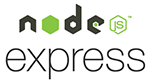

# Hola! soy jaelEspinosa

[][linkedin]
[][Gmail]
[][whatsapp]

 
 
 
 

# Dev Fullstack

 Me considero una persona proactiva y con mucha curiosidad a la que le encantan los retos. Siempre con el lema: 
 
 "Para obtener resultados distintos has de realizar tareas distintas."

Esto es la realidad de que no siempre los resultados llegan a la primera,  y a veces hay que cambiar de estrategia.
 
 

## Certificaciones:
 

## Tecnologías:
 
DEV Technologies:
 
 

 

 

## Herramientas:

 

 
 

[linkedin]:https://www.linkedin.com/in/jose-antonio-espinosa-lucia/
[Gmail]: mailto:jaelespinosa@gmail.com
[whatsapp]: https://wa.me/34659795230

